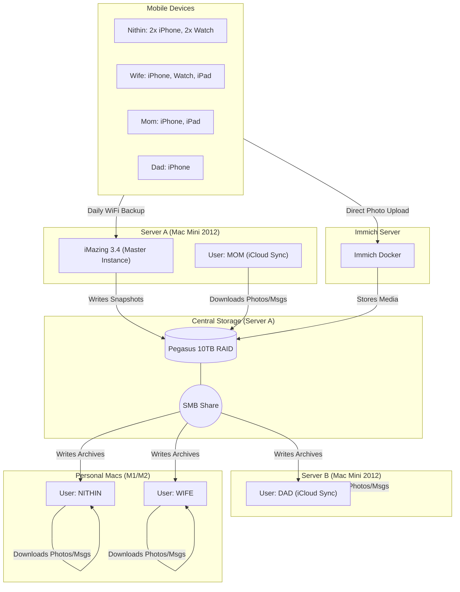

# 🏰 Project: Sovereign Cloud (Distributed Architecture)

**Status:** Draft / Implementation Phase
**Objective:** Complete migration from iCloud 2TB family plan to self-hosted infrastructure using distributed compute nodes for data scraping and centralized storage for archiving.

## 1\. Executive Summary

This project replaces Apple's centralized cloud with a **Distributed Local Cloud**. Instead of one server struggling to sync 4 separate iCloud accounts, we distribute the load across 4 specialized Mac nodes.

  * **Photos:** Managed by **Immich** (running on a dedicated Linux/Docker server).
  * **Device Backups:** Centralized on **Server A** via **iMazing**.
  * **Message/Cloud Archival:** Distributed across 4 Macs (1 per person) to ensure 100% uptime for sync streams without "Fast User Switching" conflicts.

-----

## 2\. Hardware Topology

### The "Compute Grid"

We assign a physical Mac to act as the "Bridge" for each human's iCloud data.

| Node Name | Hardware | OS | Primary Role | Assigned Human |
| :--- | :--- | :--- | :--- | :--- |
| **Server A** | Mac Mini 2012 (i7/16GB) | macOS Monterey (OCLP) | **Master Backup Controller** | **Mom** (+ All iMazing Backups) |
| **Server B** | Mac Mini 2012 (i5/8GB) | macOS Monterey (OCLP) | **Identity Node** | **Dad** |
| **Node Nithin** | Mac Mini (M1/M2) | macOS Sequoia | **Identity Node** | **Nithin** |
| **Node Wife** | Mac Mini (M1/M2) | macOS Sequoia | **Identity Node** | **Wife** |
| **Immich Box** | Separate Server | Linux/Docker | **Photo AI & Hosting** | *Everyone* |

### Storage Infrastructure

  * **Primary Storage:** 10TB Pegasus R4 RAID (Attached to **Server A**).
  * **Network Protocol:** SMB (Server A shares the RAID to all other nodes).

-----

## 3\. Architecture Diagram



-----

## 4\. Device & Backup Matrix

This table defines exactly where each device's data lands.

**Note:** Apple Watch backups are *embedded* inside the iPhone backup. They do not need separate handling; as long as the iPhone is backed up by iMazing, the Watch data is safe.

| Owner | Device | **Backup Destination** (iMazing) | **Archive Handler** (Messages/Legacy Photos) |
| :--- | :--- | :--- | :--- |
| **Nithin** | iPhone 15 Pro | Server A (Over Wi-Fi) | Node Nithin |
| **Nithin** | iPhone (Secondary) | Server A (Over Wi-Fi) | Node Nithin |
| **Nithin** | Apple Watch Ultra | *Inside iPhone Backup* | N/A |
| **Nithin** | Apple Watch S8 | *Inside iPhone Backup* | N/A |
| **Wife** | iPhone 14 Pro | Server A (Over Wi-Fi) | Node Wife |
| **Wife** | iPad Air | Server A (Over Wi-Fi) | Node Wife |
| **Wife** | Apple Watch | *Inside iPhone Backup* | N/A |
| **Mom** | iPhone 13 | Server A (Over Wi-Fi) | **Server A** (Local User) |
| **Mom** | iPad Mini | Server A (Over Wi-Fi) | **Server A** (Local User) |
| **Dad** | iPhone 12 | Server A (Over Wi-Fi) | **Server B** (Local User) |

-----

## 5\. Implementation Strategy

### Phase 1: Storage Networking (The Backbone)

Since **Server A** holds the physical RAID, it must act as the File Server for the whole network.

1.  **Server A:** Enable "File Sharing" in macOS Settings.
2.  **Server A:** Add the Pegasus Volume to shared folders.
3.  **Permissions:** Create a generic "BackupUser" or ensure your Nithin/Wife accounts have Read/Write access to the Pegasus share.
4.  **Clients (Server B, Nithin, Wife):** Set the Pegasus drive to **auto-mount at login**.
      * *System Settings \> Users & Groups \> Login Items \> Drag the network volume here.*

### Phase 2: The "Identity Node" Setup

For **Server B (Dad)**, **Node Nithin**, and **Node Wife**:

1.  **Configure Messages:** Enable "Messages in iCloud" to download the full history to the local Mac cache (`~/Library/Messages`).
2.  **Configure Legacy Photos:** Enable "Download Originals" in Photos app (Targeting the Networked Pegasus Drive).
      * *Note:* Hold `Option` when opening Photos to create the library directly on the network share.
3.  **Automate Archival:**
      * Install `imessage-exporter` on each node.
      * Create a simple Cron job or Calendar script to run the export weekly:
    <!-- end list -->
    ```bash
    # Example Script for Node Wife
    imessage-exporter -f html -o /Volumes/Pegasus/Archives/Wife/Messages
    ```

### Phase 3: The "Master Backup" (Server A)

Server A has the heaviest load: it runs the backup radio tower.

1.  **Install iMazing 3.4** (Licensed for 20 devices).
2.  **Optimization:**
      * Connect the Mac Mini to Ethernet (Critical).
      * Disable Sleep: `sudo pmset -a sleep 0`.
3.  **Pairing:**
      * You must plug in each of the 15 devices **once** via USB to establish the Wi-Fi trust pair.
      * After that, configure "Automatic Backups" -\> "When battery \> 20%" -\> "Destination: Pegasus RAID".

### Phase 4: Immich (The "New" Cloud)

Since Immich runs on a separate server, just ensure its **Storage Volume** is mapped to the Pegasus RAID (via NFS or SMB mount on the Linux box).

  * **Safety Check:** This ensures that if the Immich server hardware dies, your photos are still physically safe on the Pegasus RAID connected to Server A.

-----

## 6\. Disaster Recovery & maintenance

### The "What If" Scenarios

1.  **Server A Dies:**
      * *Impact:* No backups run. SMB share goes down.
      * *Recovery:* Move Pegasus RAID to **Server B**. Share it. Point Immich to new IP.
2.  **Server B Dies:**
      * *Impact:* Dad's messages stop archiving.
      * *Recovery:* Dad's iPhone is still backed up daily by Server A. No immediate data loss.
3.  **Pegasus RAID Failure:**
      * *Impact:* **Catastrophic.**
      * *Mitigation:* You MUST have a cloud backstop.
      * *Action:* Install **Backblaze** on Server A. It will back up the attached Pegasus RAID to the cloud for \~$9/month. This is your "fire insurance."

### Maintenance Schedule

  * **Monthly:** Reboot Server A and Server B to clear RAM caches.
  * **Quarterly:** Check "Health Auto Export" on iPhones to ensure they haven't reverted settings.
  * **Yearly:** Validate one random backup restore (e.g., restore a backup to an old spare iPhone to prove it works).
