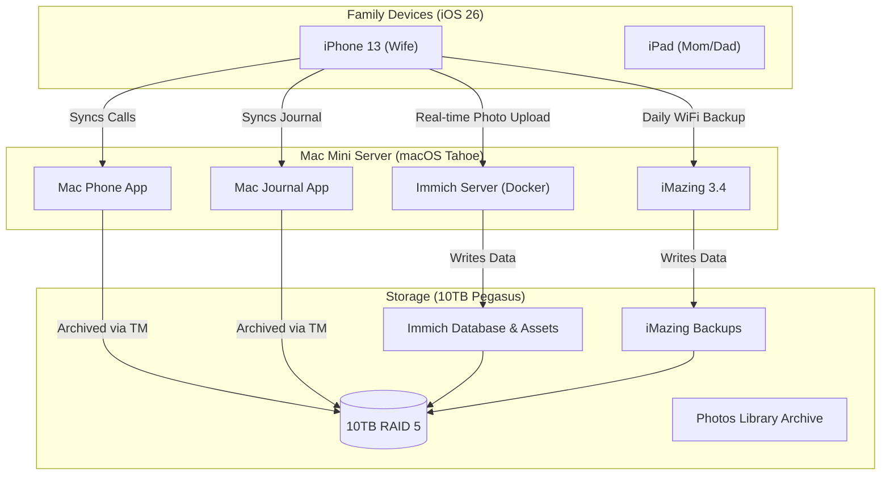

### **Executive Summary: The "Sovereign Cloud" Transition**

#### **1. The Objective**

To eliminate the 2TB iCloud dependency for your 20+ family devices and migrate to a **private, self-hosted cloud** running on your Mac Mini and 10TB Pegasus RAID. This transition will leverage **Immich** for photo management and **iMazing 3.4** for device state backups, ensuring data sovereignty, privacy, and long-term cost savings.

-----

#### **2. The New Architecture**

The following diagram illustrates how your data flows in the new "Tahoe-Era" setup. The Mac Mini acts as the central "Digital Hub," a philosophy returned to prominence with macOS Tahoe.

-----

#### **3. Strategic Trade-offs Matrix**

| Feature | **Old Way (iCloud 2TB)** | **New Way (Self-Hosted)** | **The "Tahoe" Advantage** |
| :--- | :--- | :--- | :--- |
| **Photos** | Seamless, expensive, "rented" storage. | **Immich:** Free, fast, you own the drive. Slightly less "polished" sharing. | Tahoe's "Liquid Glass" UI doesn't affect Immich; `osxphotos` still works perfectly. |
| **Messages** | Syncs across devices instantly. | **Archived:** Readable HTML/PDF via `imessage-exporter`. No real-time sync between devices. | **N/A** (Messages app on Mac still bridges this gap). |
| **Call Logs** | Stuck in iPhone Backup. | **Live Sync:** Syncs to Mac's **Phone App** database automatically. | **Huge Win:** macOS Tahoe allows local archiving of call logs without full device backups. |
| **Backups** | "Set and Forget" (until storage fills). | **iMazing:** Granular control, snapshots, incremental updates. | iMazing 3.4 is optimized for Tahoe’s file system. |
| **Privacy** | Apple holds the keys (mostly). | **Total Sovereignty:** No data leaves your house. | **Critical:** Protects you from AI scanning of cloud photos. |
| **Risk** | Account lockout = Data loss. | Drive failure = Data loss. | **Mitigation:** You must back up the Pegasus drive to a cheap cloud (e.g., Backblaze). |

-----

#### **4. The Transition Plan (Phased)**

This process is designed to prevent data loss. **Do not cancel iCloud until Phase 3 is complete.**

##### **Phase 1: The "Great Download" (Weeks 1-2)**

  * **Goal:** Secure a local copy of all 300GB+ of photos and 50GB of messages.
  * **Action A:** Create macOS User Accounts for `Wife`, `Mom`, `Dad`.
  * **Action B:** Configure "Download Originals" in Apple Photos for each user to the Pegasus Drive.
  * **Action C:** Install **Immich** via Docker on the Mac Mini.
  * **Action D:** Use `osxphotos` + `immich-go` to import the Apple Photos libraries into Immich.

##### **Phase 2: The "Space Swap" (Week 3)**

  * **Goal:** Move the heavy data (Photos) off the phones to make room for the critical data (Messages/WhatsApp) so iMazing can back them up.
  * **Action:** Run "Free Up Space" in Immich on the iPhones. (Only *after* verifying Phase 1).
  * **Result:** iPhone free space jumps from \~5GB to \~100GB.
  * **The Switch:** Disable "Messages in iCloud" on iPhones and choose **"Download and Disable"**. This forces the 50GB chat database onto the local phone storage.

##### **Phase 3: The "Tahoe Cleanup" (Week 4)**

  * **Goal:** Ensure new macOS Tahoe features aren't hiding data.
  * **Action A (Health):** Open "Health Auto Export" app -\> Settings -\> Change Export Location to "On My iPhone" (prevents Tahoe from excluding it as "Cloud Data").
  * **Action B (Journal):** Launch the **Journal App** on Mac Mini to force a sync of all journal entries to the Mac's local disk.
  * **Action C (iMazing):** Configure iMazing 3.4 for "Automatic Wi-Fi Backups" targeting the Pegasus Drive.

##### **Phase 4: Cancellation (Month 2)**

  * **Action:** Downgrade iCloud to the free 5GB tier.
  * **Verification:** Confirm Immich is uploading new photos and iMazing is creating daily snapshots.

-----

#### **5. Technical Specifications for Your Setup**

| Component | Recommendation | Note |
| :--- | :--- | :--- |
| **Server** | Mac Mini (2012/M1) | Ensure Docker has at least 8GB RAM allocated for Immich ML tasks (Face detection). |
| **Storage** | 10TB Pegasus R4 (RAID 5) | **Critical:** Enable "File Fast Clone" if formatted as APFS to save space on iMazing snapshots. |
| **Software** | iMazing 3.4 | Required for macOS Tahoe compatibility. |
| **Database** | PostgreSQL (Immich) | **Must be backed up.** Configure a cron job to dump the SQL database to a separate folder nightly. |
